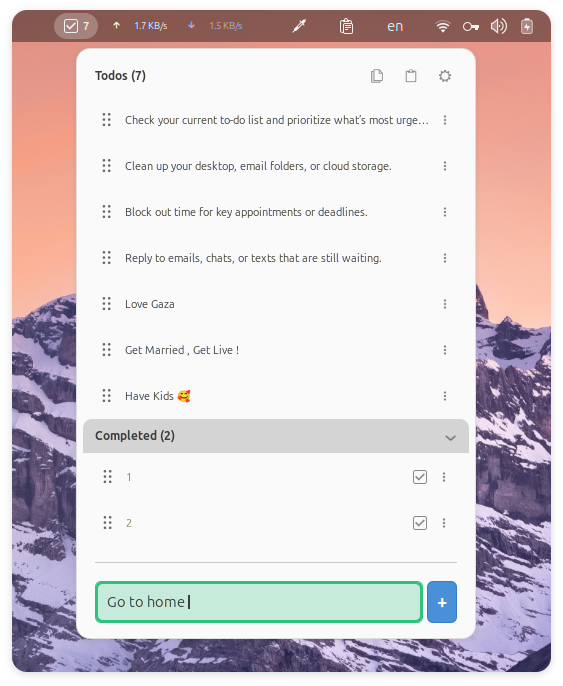
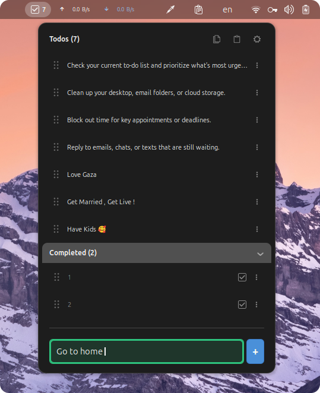
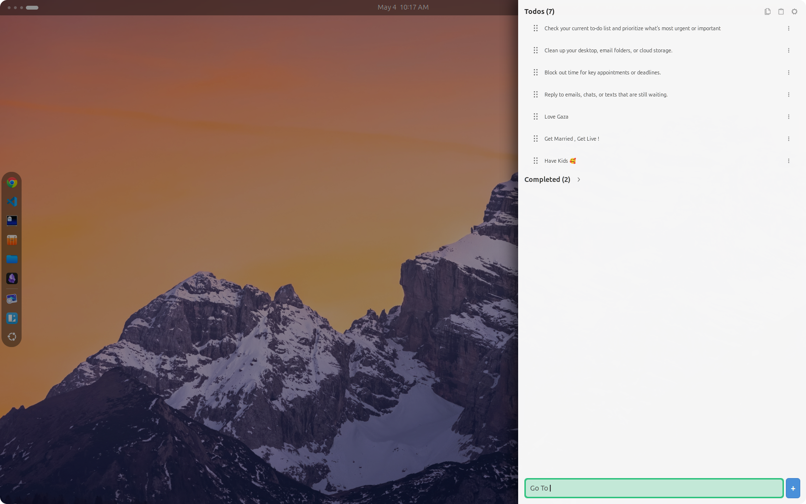
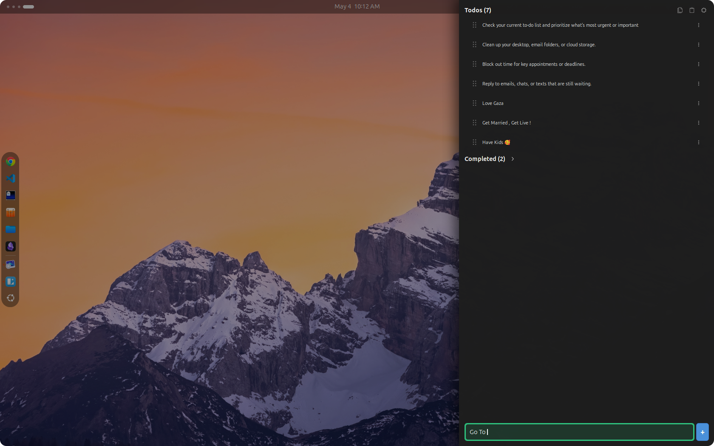

<h1 align="center">Snap Todo</h1>
<h3 align="center">Gnome extension lets you write and manage your todos without friction</h3> 

  

  

## ⚡ 1. The Quick Capture Philosophy
**1.** Hit `Alt + T`  
**2.** Write  
**3.** Press `Enter`  

## ⚡ 2. The Fluidity System

Navigate, organize, and complete your todos incredibly fast and easy.

| Action | Shortcut | Description |
| :--- | :--- | :--- |
| **Toggle Snap-todo** | `Alt + T` *(Customizable)* | Instantly opens the dropdown menu or slide-out drawer. Focus is automatically trapped in the text entry. |
| **Navigate** | `Up` / `Down` / `Tab` | Fluidly navigate through your todos. |
| **Reorder Todos** | `Alt + Up/Down` | Reorder todos by pressing Alt and moving the todo up or down using arrows. |
| **Toggle Status** | `Space` | Mark a todo as completed or active. |
| **Delete Todo** | `Delete` | Remove a todo. |
| **Dismiss UI** | `Esc` | Close the drawer and return to your workspace. |

## ⚡ 3. Dual UI Modes
Choose the layout that fits your workflow.

Note : Click on the features to see screenshots for each feature.
 

   
1. <strong>Normal Menu </strong> A traditional, lightweight dropdown menu attached directly to your Gnome's  top bar.

  <ul>
    <li>
     

      
Light Mode

        

            <ul>
              
 

            </ul>
        

      

    </li>
  </ul>

  <ul>
    <li>
     

      
Dark Mode

        

            <ul>
              
 

            </ul>
        

      

    </li>
  </ul>

   
2. <strong>Slide-out Drawer </strong>  A modern, full-height side panel that slides in for maximum screen real estate.

  <ul>
    <li>
     

      
Light Mode

        

            <ul>
              
 

            </ul>
        

      

    </li>
  </ul>

  <ul>
    <li>
     

      
Dark Mode

        

            <ul>
              
 

            </ul>
        

      

    </li>
  </ul>

## Installation

To install the latest version of the extension head to the Official GNOME Extensions website.

## Support

